#  Midpoint Report: B+Trees for In-Memory Databases using Hardware Transactional Memory

## Summary
We implemented an optimized B+Tree using restricted transactional memory (RTM) and compared the performance with a more traditional optimistic lock coupling approach. Our deliverables include graphs and performance analysis indicating the benefits and drawbacks of RTM vs optimistic locking along with our HTM B+Tree implementation. We ran our experiments on a 2-socket machine that supports Intel® TSX® with two Intel® Xeon® Silver 4114 processors with 10 cores and 20 hyperthreads each. 

## Background
B+Tree are in memory data structures that are used to index data in databases and file systems. For this project we focused on their uses cases in in-memory databases. B+Tree are a self balancing tree where each node can have at most n children. They ensure balancing by having an invariant that all leaves are the same distance from the root node. B+Trees (Figure 2) are different from B-Trees (Figure 1)  in that in B+Tree inner nodes only store keys used to navigate down the tree. The value associated with the keys is stored within the leaf nodes, and all keys are represented within the leaf nodes. To allow for efficient lookup the keys within each node are sorted in increasing order. This way when traversing the tree at each node the subtree containing a key can be retrieved by doing a binary search on the ranges of the children.

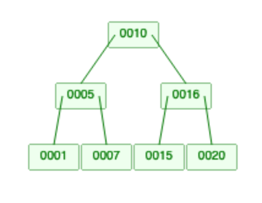
*Figure 1: B-Tree*
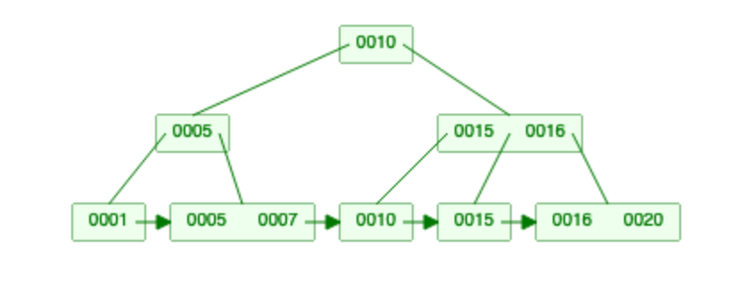
*Figure 2: B+Tree*

Within in-memory databases B+Trees are used to build indexes on tables. Indexes are intended to allow for efficient data retrieval based on specific attributes of the tuples contained in the table. For this use case the keys are attributes within the tuple and the value is an address pointing to the location of the tuple. Database indexes provide operations such as insert, lookup, delete, and scan but for this project we focused on optimizing insert and lookup. 

Insert takes a key and a value as parameters and traverses the tree to insert key at the bottom of the tree. When inserting though the algorithm has to ensure that no node exceeds its maximum number of children, which it does so by splitting full nodes. A node split involves creating a new node, moving half the keys in the splitting node into the new node, and then adding the new node as a child of the parent. If the root node is split then a new root node is created as well and the old root node and it’s split node become children of the new root node. There are two common approaches of when to split, eager and lazy splitting. In an eager splitting approach the program traversing down the tree will split a node whenever it detects that the node is at capacity. In a lazy approach the key being inserted will be inserted at a leaf and then the leaf is split only if it exceeds capacity and then ancestor nodes are split accordingly if they are full as well. 

Lookups are more straightforward in that they don’t make any modifications. Lookup takes a key as a parameter and returns the value associated with the key. The function traverses the tree, doing a binary search at each node to find the corresponding subtree to traverse down. Once it reaches a leaf node it returns the value associated with the key found there. 

Database workloads often involve querying the index multiple times and launching a query doesn’t have data dependencies on launching other queries. Therefore it is possible to parallelize the workload by running multiple queries on an index concurrently. With inter-query parallelism lookups are dependent on the current node the program is operating on remains unchanged. Inserts, with eager splitting, only require that the current node and it’s parent must not be modified. The parent is a dependency since when splitting a new child is inserted into the parent. With lazy splitting all of the ancestors of the leaf node could be modified, as a split can recursively cause splits all the way up to the root node. Intra query parallelization is difficult since identifying the next node on which to continue the traversal requires finishing a binary search on the current node.  

Within a query there isn’t much cache locality as each step involves a node which is a new data location. Across queries though it is possible to improve cache locality by reordering queries in a way that queries that taking similar paths down the tree would be grouped together. But this would require complex static analysis identifying possibilities for index operation reordering without breaking cross query data dependencies and it would also require knowledge of the operations being run before running them. For this project though we chose to focus more on online operations, where not all the operations are known beforehand, and on parallelizing the data structure rather than on analysis and reordering of the inputs. 

## Approach
### Initial Implementation
We started off with an optimistic lock coupling (OLC) based [approach](https://github.com/wangziqi2016/index-microbench/blob/master/BTreeOLC/BTreeOLC.h) by Dr. Viktor Leis from Technische Universität München. Lock coupling involves holding crabbing down the tree while holding two locks (the locks for the parent and the current node) at a time. Whenever moving on from a node to a child the lock on the parent is released and the lock for the child is grabbed. Optimistic means that readers don’t block or take locks, instead when they would normally release a lock they would verify if the version of the node matches the version they initially read. If the versions changed then they would retry the operation again as the data has changed. Writers do take locks on the node and when they release the lock they update a version counter to indicate that the data was modified. On lookups only read locks would be taken. On writes, write locks only need to be taken when splitting a node or when inserting into the leaf node. For the rest of the traversal only read locks are needed.

We started off with this implementation as OLC is one of the most common parallel implementations for B-Trees and it takes a similar approach to that of restricted transactional memory (RTM). Intel TSX, the RTM instruction set we used, provides three instructions to enable transactionality: 
1. _xbegin: begins a transactional region
2. _xend: ends a transactional region
3. _xabort: aborts the current running transaction.

RTM operates by enabling sections of code to operate with transactional semantics. This means that with respect to other transactional sections each section operates as if it was isolated and atomic. This is achieved by adding all variables read to a transactions read set and all variables written to a write set. Whenever a transaction is committed a coherence notification is sent out invalidating the variables in the write set. If a current running transaction sees that the variables in it’s read and write sets are invalidated then it aborts. This is similar to OLC in that readers don’t block but writers invalidate other transactions. But unlike OLC approaches RTM isn’t guaranteed to make progress. To ensure progress it needs a fallback path that it can execute that doesn’t use RTM. 

For our initial implementation we created a single threaded version of the B+Tree and encased each insert and lookup operation in an RTM transaction. Then we used the latch coupling implementation (not optimistic) as a fallback path which would be taken if the RTM transaction restarted too many times. More analysis about picking the maximum number of restarts is in the results section. As we began testing we noticed that the transactions were aborting ~80% of the time and resorting to the fallback path. We experimented with varying datasets and found that ordering inserts by increasing order of keys would only cause transactions to abort on node split as we expected. We realized this was because when key was being inserted into a node if the key was in the middle of the range of keys then the existing keys in the node would be shifted over to maintain sorted order. Shifting these keys over exceeded the memory limits of an RTM transaction causing it to abort. To address this we limited each node’s maximum number of entries to 31, as shifting that many keys was the memory limit for HTM transactions. 

### Addressing Concurrency
At this stage though we encountered corrupted data as there were race conditions while executing the operations. The RTM transaction was thread safe with respect to other RTM transactions and the fallback latch coupling implementation was thread safe with respect to itself. But they weren’t thread safe with respect to each other. For instance, even if a latch coupled traversal has taken a lock and is reading a node the RTM implementation could modify the data as it has no notion of a lock being taken. To fix this we had to add the lock of each node touched in an RTM traversal to the read set of the transaction. The RTM transaction would check if the lock is taken before going to a node, if it is taken then it would abort and retry. Also if the fallback path of another thread takes the lock it would execute a write to the lock variable which in turn would cause all transactions who have the lock in their read set to abort. This ensures that the RTM transaction and the latch coupled fallback path are thread safe with respect to each other. 

These changes allowed our implementation to be correct but it wasn’t performant. The non-optimistic latch coupling path would take too many locks while traversing the tree and cause many transactions to abort. Whenever a new traversal was started it would take and release a lock on the root node, which involves writing to the lock. All running RTM transactions would have the lock for the root node in their read set and thus would be aborted by this write. 
To get around this bottleneck we changed our fallback path to be an OLC implementation. In these cases the fallback path would only write to a node’s lock when modifying the node, therefore only aborting running RTM transactions when necessary. But this change brought back data corruption and race conditions.

Having an OLC based fallback complicated the interaction between the RTM path and the fallback path. Now there were 4 possible paths of interaction between RTM and OLC at a specific node: 
1. RTM Read and OLC Write 
2. RTM Read and OLC Read
3. RTM Write and OLC Write
4. RTM Write and OLC Read. 

RTM Read and OLC Write is addressed much like the synchronization in the non optimistic fall back implementation with the RTM checking if the node’s lock is free aborting if it isn’t and adding it to the read set if it is. If the OLC write starts first then the RTM read will see it and abort as the lock was taken. If the RTM read start first the OLC write will invalidate the lock and since it was in the RTM read set the transaction would get aborted. 

In the case of RTM Read and OLC Read both can safely run concurrently so no extra synchronization is required. 

The RTM Read and OLC Write case is solved in the same way as RTM Read and OLC Write with the RTM checking if the node’s lock is free. If RTM is committed before OLC Write then OLC write will see RTM write and will operate accordingly. If OLC write occurs before RTM is committed but after RTM has read the node then OLC will invalidate the node’s lock which is in the RTM read set and the RTM transaction gets aborted. 

The RTM Write and OLC Read case wasn’t solved by using the same synchronization approach as the non-optimistic latch coupling implementation and was the cause of our data corruption and race condition. There is a possible race in that the OLC traversal has read a node but before it could release it’s read lock and validate that the node version hasn’t changed the RTM transaction could write to the node. In our first implementation the RTM transaction wasn’t modifying a node’s locks only reading them, so the OLC traversal would see that the node’s version is the same and validate the read even though it wasn’t a valid read. To fix this we needed the RTM transaction as well to update the node’s version number when it was writing to that node. 

### Optimizations
At this point we got correctness and performance but there are two more optimizations we attempted. The first was that we didn’t want to limit a node’s maximum number of keys to 31 as this would cause more splits and thus the RTM transaction to fail more often. For inner nodes this was unavoidable but for leaf nodes, where most of the inserts would be happening, we theorized that a node’s keys don’t need to be sorted until that node is read. On inserts we would append keys to the existing list of keys at the node without shifting anything, and thus not abort an RTM transaction. Whenever a node was split or on a lookup we would sort the keys in the leaf node if it wasn’t sorted already. Our intuition was that an RTM transaction would be aborted anyway on a split, and by increasing the size of the node splits would be rarer. On a lookup only the first lookup after an insert would need to sort the keys in the node. With this we could increase the maximum entries in a node beyond 31 and in the results section we provide more analysis on how changing node size affected performance.

The second optimization we attempted was limiting the amount of data an RTM transaction would touch. Instead of enclosing the entire insert or lookup operation in an RTM transaction we weaved transactions by enclosing only the operations done at each node while traversing the tree into a transaction. So while traversing the tree the program would begin a transaction, do the operation needed at the current node, either a binary search to find the next node to go to, an insert or a split and then end the transaction once the operation at the node was completed. And then begin a new transaction at the new node. During this process though we had to check that nodes that were being operated on didn’t change between the two transactions. Each node already had a version number to enable OLC so we just had to verify that the version was the same between the two transactions. If the version was different then we would retry the insert or lookup. We theorized that by limiting the size of a transaction there would be fewer aborts of transactions and the fallback path would be used less. The analysis for this is further expanded on in the results section. 

## Results
In this section we will present the results evaluating the RTM B+Tree performance in differing conditions. All experiments were run on a 2-socket machine two Intel® Xeon® Silver 4114 processors with 10 cores and 20 hyperthreads each and 125 GB of memory. All values are the minimum across 5 runs. Speedup values are based on a baseline single threaded implementation.

### Workload
To evaluate performance with changing workloads we created a workload generator that would vary the ratio of inserts to lookups. The generator would take in number of operations (N) and the percentage of operations to be inserts (P) as parameters. Each operation could be a lookup or insert and in order to simulate a more realistic workload when generating each operation the operator would pick either an insert or a lookup from a weighted binomial distribution where an insert is selected with P probability. For multithreaded workloads each thread was given a chunk of the total workload and each chunk would only have lookups of values also inserted within that chunk. For lookup only workloads the inserts would occur beforehand and only inserts would be timed. 

### System Parameter Evaluations
There were two system wide parameters that we had to set. The first is how many times should an RTM transaction be allowed to restart before taking the fallback path. And the second is what is the maximum number of entries a leaf node should contain. 

#### Max Restart Count
In this benchmark we scaled the maximum times an RTM transaction could be allowed to restart before resorting to the fallback path and graphed the speedup on datasets with a varying percentage of inserts. This was executed using 40 threads and 10 million operations were run per workload. 

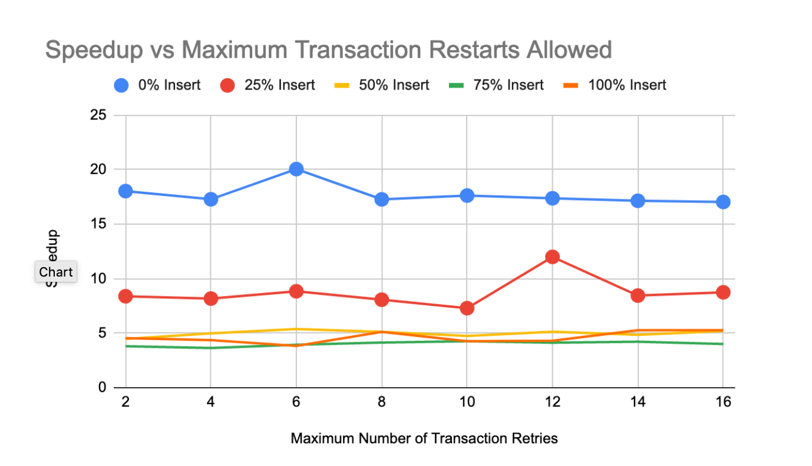

In general the maximum restart count had little effect on the performance of the system. Except for the outlier at 12 for 25% Insert workload there was little change in speedup across all the workloads. 

We further investigated as to why this was the case by examining how many retries a transaction needed before succeeding. Below is a graph showing the number of operations that succeeded vs the number of retries that operation needed to succeed. Since lookups have a different pattern than inserts we graphed lookup retries and insert retries separately. 

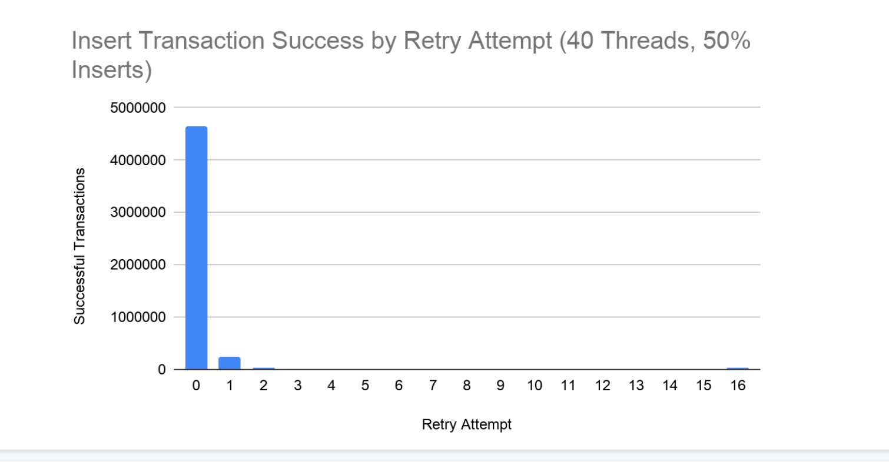
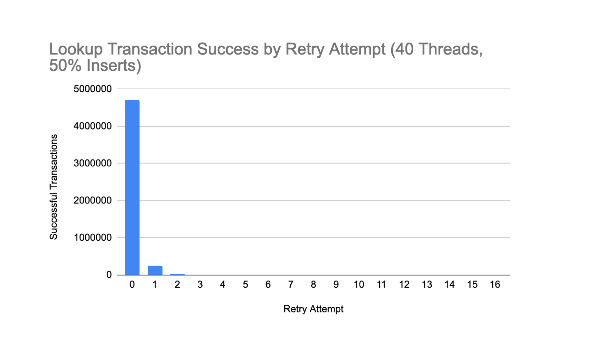

From this we can see that most transactions succeed without ever retrying. We omitted the graphs for other workloads with different Insert percentage as they displayed a very similar pattern. In the case of the 50% Insert workload 92% of inserts and 94% of lookups succeeded without ever retrying. This data holds true with our initial observation of maximum number of retries not affecting speedup as most transactions never retried. 

We also ran the same experiment on the OLC implementation. And found that the OLC implementation restarted even less with 99% of lookups and inserts succeeding without ever retrying. 

#### Maximum Number of Entries Per Leaf Node
In this benchmark we scaled the maximum number of entries a leaf node could contain before splitting. Using our optimization of sorting on the first lookup after insert or on a split we could increase the maximum number of entries beyond 31. Similar to the maximum restart count benchmark  we graphed the speedup on datasets with a varying percentage of inserts. This was also run on 40 threads with 10 million operations per workload. 

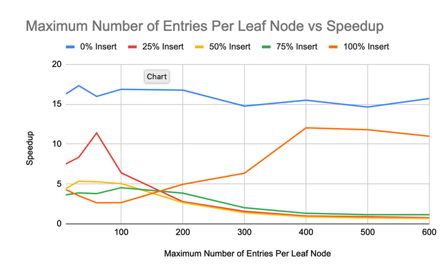

Increasing the maximum number of entries significantly improved the speedup of the Insert only workload (100% Insert). It grew from a 3.5x speedup at 31 max entries to a 12x speedup with 400 max entries. This makes sense as in an insert only workload the entries in a leaf node are only sorted when the node is split and every other insert is much faster as it is just an append. Also increasing the node size also means that splits are less common making the sorting even rarer. 

For all other workloads which had Inserts mixed with Lookups increasing the maximum number of entries per leaf reduced the speedup. This also makes sense are every Lookup followed by an Insert has to sort the leaf node. Even if the node was just sorted and a single value was inserted the following lookup would have to sort again. This incurs an O(n log(n)) cost on lookups rather than the original O(log (n)) cost to lookup at a leaf node. The 25% Insert workload peaked with 11.3x speedup with 60 max entries, the 50% Insert peaked at 5.3x speedup with 31 max entries, and the 75% Insert peaked at 4.5x speedup with 100 max entries. 

In the lookup only workload (0%  Insert) the maximum number of entries didn’t affect the speedup. This is because for lookup only workloads the sorting cost is only encountered once, on the first lookup. Therefore the number of entries in the leaf node isn’t as much of a bottleneck. 

### Transaction Weaving Evaluation

Here we evaluate the transaction weaving approach we discussed in the approach section. The premise was that by having more smaller RTM transactions we would have fewer conflicts as the read and write sets of each transaction would be smaller and thus fewer insert and lookup operations would resort to the fallback path. 

First we compared the fallback percentages between the original RTM implementation and the weaved implemented scaling the number of threads. We ran this on a variety of workloads, but here we will discuss the 50% Insert workload. The rest of the graphs are linked in the appendix.

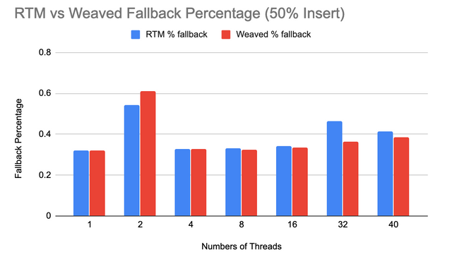

As we suspected in cases with more threads which would have more contention there was a lower fallback percentage for the weaved implementation. But this difference is minimal and didn’t improve the speedup. Below is a graph comparing the speedup of the two implementations on the same workload and the weaved implementation did worse. We believe this is because the number of times the fallback path was taken was already very small and the improvement from weaved is minimal. Therefore the extra overhead of starting and ending transactions overshadowed the weaved improvement. 

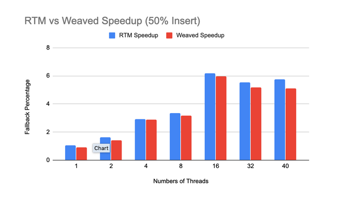

### Comparisons Between OLC and RTM
Here we evaluated the differences in speedup between the OLC implementation and RTM implementation at different workloads varying the percentage of Inserts. For each workload we ran two experiments. The first experiment scaled the number of threads and was run with 10,000,000 operations and the second experiment scaled the dataset size and was run with 40 threads. As a baseline we also graphed the speedup for an implementation that used non-optimistic latch coupling which we labeled as Locked.

#### Lookup Only Workload

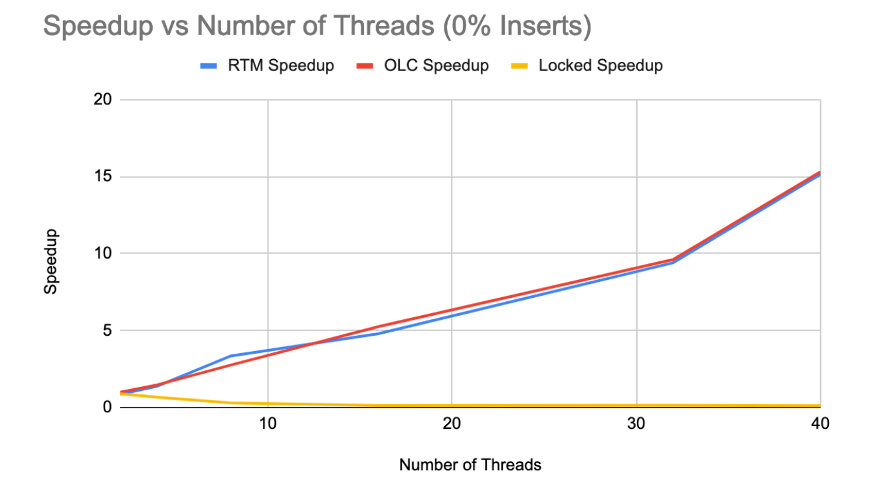

In the lookup only workload there was very little difference in the speedups of the OLC and RTM speedups. This is so because in both implementations none of the threads would block the other threads. In the OLC version only read locks would be taken and in the RTM version the transactions would only read which would minimize the number of aborts. The locked speedup on the other hand is very low since it would block other threads at each node even when the node could be safely concurrently read. The same pattern held for scaling the dataset size. The RTM and OLC implementations had very similar speedups.

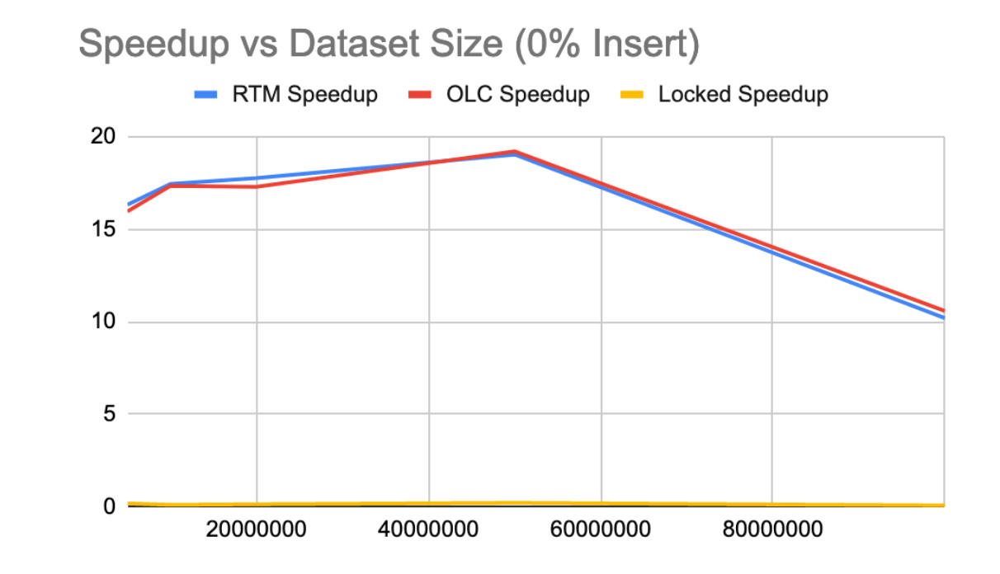

#### Mixed Insert and Lookup Workloads
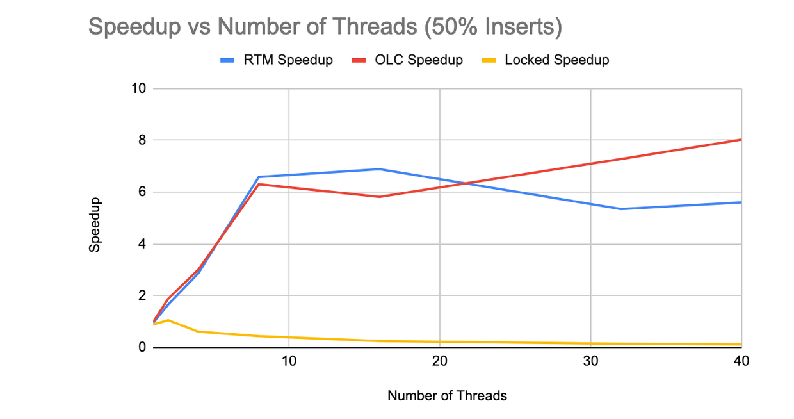

In this case the RTM implementation does better than OLC for both 8 threads and 16 threads. And then the RTM speedup tapers off with more threads. We believed this tapering is because the workload isn’t large enough to effectively evaluate performance at the larger thread count.

Once we scaled the workload size using 40 threads we saw that the RTM speedup beat the OLC speedup. This seems to indicate when the thread count and workload size are optimized RTM does better than OLC.

Though we don’t have the graphs here the workloads for 25% Insert and 75% Insert showed very similar patterns. These graphs are linked in the appendix section. 

#### Insert Only Workload

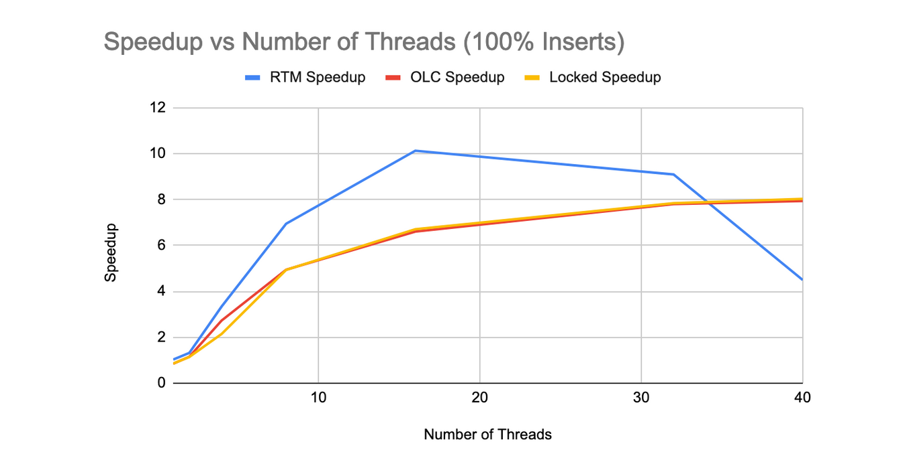

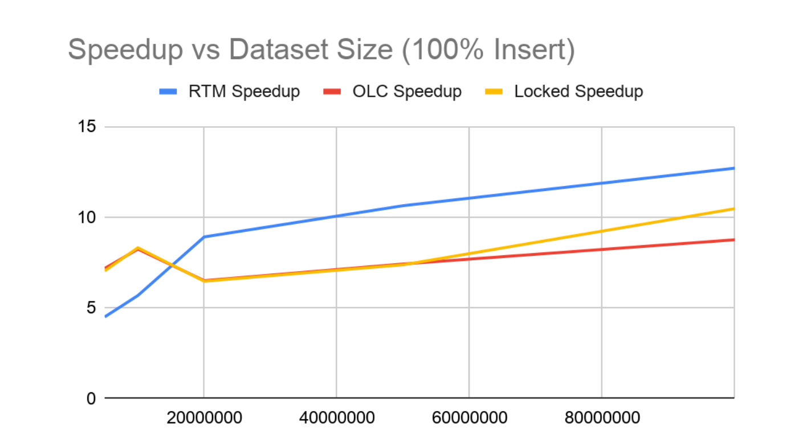

This a similar pattern as the previous workload except that the RTM implementation did better for 4 - 32 threads. The insert only workload has more work per thread than the previous workloads and seems to do better with larger thread counts than the previous workloads. This follows the observation we made above that when there is sufficient enough work to match the thread count than the RTM speedup is higher. Further confirming this is that in the Insert only workload the RTM implementation does better than the OLC implementation at smaller data set sizes than previous workloads. 

#### Analysis

From the graphs above we see that the RTM implementation does better than the OLC implementation at larger workload sizes. At the larger thread counts though the RTM version does worse but this is because 10,000,000 operations isn’t sufficient to overcome the overhead of operating on the larger thread counts for the RTM version. This suggests that the overhead of scheduling transactions is larger than that of taking locks. But if the work being done is large enough then this overhead is overshadowed by the improvements from the RTM implementation. So if the workload size and the number of threads being used to run that workload are appropriately tuned then the RTM version does better. But in situations where there is a mismatch between the workload size and the number of threads then the OLC version does better.

We believe the RTM version does better because in OLC the transaction gets aborted at the end of the transaction where the version is checked for updates. In RTM the transaction gets aborted as soon as the updated version gets committed by another transaction since the version is in the read set of the transaction. Thus there is less wasted time in the RTM implementation.

## References
[1] Wang, Ziqi., et al. “Building a Bw-Tree Takes More Than Just Buzz Words.” SIGMOD ‘18 Proceedings of the 2018 International Conference on Management of Data, pp. 473–488.

[2] Makreshanski, Darko., et al. “To Lock, Swap, or Elide: On the Interplay of Hardware Transactional Memory and Lock-Free Indexing.” VLDB Endowment, 41st International Conference on Very Large Data Bases (VLDB 2015): Proceedings of the VLDB Endowment, Volume 8, Number 1-13, Kohala Coast, Hawaii, USA, 31 August-4 September 2015, 2015, pp. 1298–1309.

[3] Brown, Trevor. “A Template for Implementing Fast Lock-Free Trees Using HTM.”

[4] Leis, Viktor, et al. “The Adaptive Radix Tree: ARTful Indexing for Main-Memory Databases.” 2013 IEEE 29th International Conference on Data Engineering (ICDE).

[5][Fun With Intel Transaction Synchronization Extensions](https://software.intel.com/en-us/blogs/2013/07/25/fun-with-intel-transactional-synchronization-extensions)

## Appendix
1. [Graphs](https://docs.google.com/spreadsheets/d/1WICy5a5WEKHrQ-3FQfw11PJ7DvwZXqHyDOfVj2tSehs/edit?usp=sharing)

